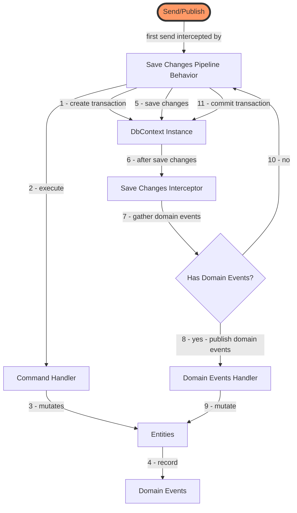

```mermaid
---
config:
---
graph TD;
    MEDIATR_SEND(["Send/Publish"]) --> |first send intercepted by|PIPELINE_BEHAVIOR;
    PIPELINE_BEHAVIOR[Save Changes Pipeline Behavior] --> |1 - create transaction|DB_CONTEXT;
    PIPELINE_BEHAVIOR --> |2 - execute|CMD_HANDLER;
    PIPELINE_BEHAVIOR --> |5 - save changes|DB_CONTEXT
    PIPELINE_BEHAVIOR --> |11 - commit transaction|DB_CONTEXT
    CMD_HANDLER[Command Handler] --> |3 - mutates|DB_CONTEXT_ENTITIES;
    DB_CONTEXT_ENTITIES[Entities] --> |4 - record|DOMAIN_EVENTS;
    DOMAIN_EVENTS[Domain Events];
    DB_CONTEXT[DbContext Instance] --> |6 - after save changes|SAVE_CHANGES_INTERCEPTOR;
    SAVE_CHANGES_INTERCEPTOR[Save Changes Interceptor] --> |7 - gather domain events|GATHER_DOMAIN_EVENTS;
    GATHER_DOMAIN_EVENTS{Has Domain Events?} --> |8 - yes - publish domain events|DOMAIN_EVENTS_HANDLER;
    GATHER_DOMAIN_EVENTS --> |10 - no|PIPELINE_BEHAVIOR;
    DOMAIN_EVENTS_HANDLER[Domain Events Handler] --> |9 - mutate|DB_CONTEXT_ENTITIES


    classDef green fill:#9f6,stroke:#333,stroke-width:2px;
    classDef orange fill:#f96,stroke:#333,stroke-width:4px;
    class MEDIATR_SEND orange
```